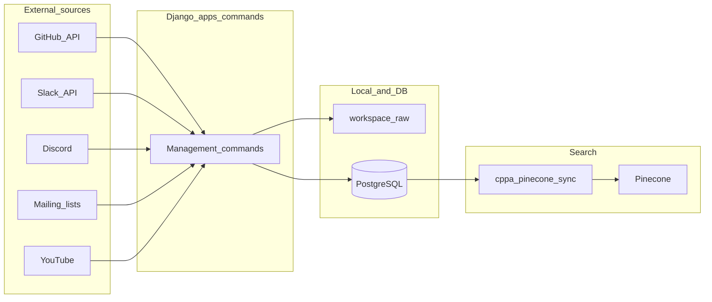

# Collector data flow (architecture)

High-level view of how data moves through Boost Data Collector. For execution order and scheduling, see [Workflow.md](Workflow.md).

- **Collectors** are Django apps exposing `management/commands` (scheduled via `boost_collector_runner` YAML + Celery Beat, or run manually with `manage.py`).
- **Workspace** holds clones, exports, and intermediate files under `WORKSPACE_DIR` (see [Workspace.md](Workspace.md)).
- **PostgreSQL** is the system of record for ORM models across apps.
- **cppa_pinecone_sync** (and app-specific upsert paths) push embeddings/metadata to **Pinecone** namespaces.
