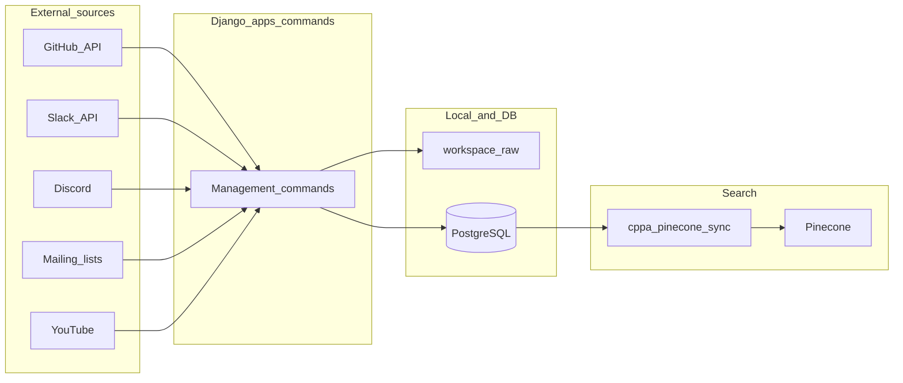
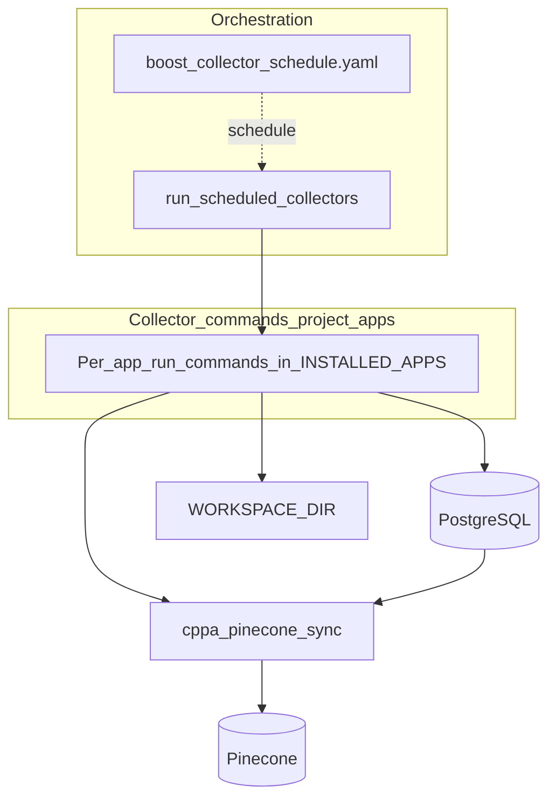

# Collector data flow (architecture)

High-level view of how data moves through Boost Data Collector: external sources, Django collector apps, shared storage, and vector search. For execution order, Celery Beat, and YAML groups, see [Workflow.md](Workflow.md). For the schedule → command wiring, see [Development_guideline.md](Development_guideline.md#architecture-high-level).

**Schema vs flow:** [Schema.md](Schema.md) documents tables and relationships per domain. This page complements it by showing **cross-app data movement** (ingest → PostgreSQL / workspace → Pinecone), which is easy to miss when reading ORM diagrams alone.

## 1. External sources → collectors → storage → vectors

- **Collectors** are Django apps exposing `management/commands` (scheduled via `boost_collector_runner` YAML + Celery Beat, or run manually with `manage.py`).
- **Workspace** holds clones, exports, and intermediate files under `WORKSPACE_DIR` (see [Workspace.md](Workspace.md)).
- **PostgreSQL** is the system of record for ORM models across apps.
- **cppa_pinecone_sync** (and app-specific upsert paths) push embeddings/metadata to **Pinecone** namespaces.

## 2. Orchestration and components (per app)

Scheduled batch work is driven by **`boost_collector_runner`** reading **`config/boost_collector_schedule.yaml`**, which invokes **`run_scheduled_collectors`** → individual **`run_*` management commands** (one command per task line in the YAML).

**Typical persistence** (column below): where this app **usually** stores durable data during normal runs. **PostgreSQL** = Django ORM tables in the shared DB. **`WORKSPACE_DIR`** = files under the configured workspace root (`workspace/<app>/…` or `workspace/raw/…`; see [Workspace.md](Workspace.md)). **Pinecone** = remote vector index. Apps may also call external APIs without listing them here (e.g. GitHub for pushes).

**Django apps (project)** — each row is an `INSTALLED_APPS` entry that participates in collection, sync, or shared identity (not an exhaustive command list; see each app’s `management/commands/` and [docs/README.md](README.md)).

| Django app | Role (summary) | Typical persistence |
|------------|----------------|------------------------|
| `core` | Shared collector types (`AbstractCollector`, `BaseCollectorCommand`), structured errors, **`core.operations`** (GitHub/Slack I/O helpers — not a separate app) | N/A (library code; `core` has no ORM models) |
| `boost_collector_runner` | YAML schedule resolution; **`run_scheduled_collectors`** entry point | N/A (no ORM models) |
| `cppa_user_tracker` | Shared Slack/GitHub user identity used by trackers | PostgreSQL |
| `github_activity_tracker` | GitHub raw fetch utilities, workspace JSON, models used across GitHub pipelines | PostgreSQL, `WORKSPACE_DIR` |
| `boost_library_tracker` | Primary Boost org GitHub activity and library metadata | PostgreSQL, `WORKSPACE_DIR` |
| `boost_library_docs_tracker` | Boost documentation crawl / ingest | PostgreSQL, `WORKSPACE_DIR` |
| `boost_library_usage_dashboard` | Usage dashboard inputs | PostgreSQL, `WORKSPACE_DIR` (generated/export files) |
| `boost_usage_tracker` | Stars / content monitoring | PostgreSQL, `WORKSPACE_DIR` (CSV / staging paths) |
| `boost_mailing_list_tracker` | Mailing list archives | PostgreSQL, `WORKSPACE_DIR` (raw / message JSON) |
| `clang_github_tracker` | LLVM/Clang GitHub activity | PostgreSQL, `WORKSPACE_DIR` |
| `cppa_slack_tracker` | Slack messages and channels | PostgreSQL, `WORKSPACE_DIR` (per-channel JSON, raw) |
| `cppa_youtube_script_tracker` | YouTube transcript collection | PostgreSQL, `WORKSPACE_DIR` (metadata, raw VTT) |
| `wg21_paper_tracker` | WG21 committee papers pipeline | PostgreSQL, `WORKSPACE_DIR` |
| `cppa_pinecone_sync` | Hybrid vector upserts / namespaces | PostgreSQL (sync status, fail lists), Pinecone |

**Pinecone paths:** Many collectors write rows first; **`cppa_pinecone_sync`** (and some commands’ built-in sync phases) read from PostgreSQL and/or files and upsert into Pinecone. Namespace and field conventions vary by source; see [Pinecone_preprocess_guideline.md](Pinecone_preprocess_guideline.md) and per-app docs under [service_api/](service_api/).
