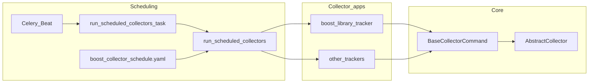

# Django app development guideline

This document outlines the development requirements and guidelines for Django apps in the Boost Data Collector Django project.

## Overview

- Django project: One Django project with multiple Django apps; all apps share the same virtual environment, settings, and database.
- Workflow: The project runs app tasks sequentially via management commands (e.g. `python manage.py run_boost_github_activity_tracker`). Scheduling uses **boost_collector_runner** with `config/boost_collector_schedule.yaml` (copy from `config/boost_collector_schedule.yaml.example` when needed). In production, Celery Beat invokes: `python manage.py run_scheduled_collectors --schedule default --group <group_id>` for a group batch, or `python manage.py run_scheduled_collectors --schedule interval --interval-minutes <n>` for an interval batch. Manual runs of a single command differ from Beat’s per-group schedule; use the Beat-style flags above when testing the YAML-driven path.
- Configuration: Django settings (e.g. `settings.py`), environment variables for database URL and API keys (e.g. via `django-environ` or `python-decouple`).

## Architecture (high level)



**GitHub activity vs Boost library tracker:** Scheduled GitHub sync for Boost repos runs through **`boost_library_tracker`** (`run_boost_github_activity_tracker`, `collect_boost_libraries`, etc.). The **`github_activity_tracker`** app holds shared fetch/sync utilities, models, and maintenance commands (e.g. workspace migration); it is not the primary entry point for the nightly Boost GitHub collector. Use `boost_library_tracker` as the reference when adding or debugging that pipeline.

For supported imports from `core`, see [Core_public_API.md](Core_public_API.md).

## Django app requirements

### 1. Programming language

- Must be developed using Python.
- Must use Python 3.13 (`requires-python` in `pyproject.toml`).

### 2. Entry point and dependencies

- Must expose one or more Django management commands in the app's `management/commands/` folder (e.g. `run_boost_github_activity_tracker.py`). Register commands in **boost_collector_runner**'s `config/boost_collector_schedule.yaml` for scheduled runs.
- Project dependencies (including app-specific ones) are listed in the project root `requirements.txt`; all apps use the same virtual environment.

### 3. Configuration and logging

- Use Django settings for environment variables and constants (e.g. from `settings.py` or env vars loaded via `django-environ`).
- Use the project's logging configuration (`settings.LOGGING`); get a logger in your app (e.g. `logging.getLogger(__name__)`).

### 4. Database access

- Must use Django ORM for database access; all data access goes through Django models.
- Use migrations for schema changes; run `python manage.py migrate` as part of setup and deployment.
- Write access: only to your app's models (or shared models your app owns). Avoid writing to other apps' tables directly.
- Read-only access: you may read other apps' models when needed; prefer loose coupling and avoid circular imports.
- Do not define ForeignKey or ORM relationships to another app's models if it would create tight coupling or circular dependencies. To use another app's data, query it in your command or service and use the result in your logic.

### 5. Exit codes

- Management commands must exit with proper exit codes when run as scripts (e.g. from `run_scheduled_collectors`).
- `0` for success.
- Non-zero for failure.

### 6. Restart and resume logic

- App tasks should implement restart logic so that if a command is interrupted and run again, it can resume without redoing completed work.
- Check the database or state to see what has already been done; skip already processed items to avoid duplicate work.

## What the Django project provides

The project provides:

1. Settings and configuration: `settings.py` (Django settings; database, logging, installed apps), and environment variables for database URL, credentials, and API keys (e.g. via `django-environ` or `python-decouple`).
2. Database: One PostgreSQL database shared by all apps; migrations are run from the project root.
3. Execution: `manage.py` and management commands; within a single `run_scheduled_collectors` batch, app commands run in order sequentially. Separate Celery Beat entries may still run concurrently across workers.

## Local development setup

Use these steps to get the Django project running on your machine.

1. Clone the repository and open the project root (where `manage.py` lives).
2. Create a virtual environment (e.g. `python -m venv .venv`) and activate it.
3. Install system dependencies you need. For **`boost_library_docs_tracker`** / **`run_boost_library_docs_tracker`**, install the **`pandoc`** binary for your OS (see [README — System dependencies](../README.md#system-dependencies)); `pip` only installs the `pypandoc` wrapper.
4. Install dependencies (e.g. `pip install -r requirements.txt`).
5. Copy the sample env file (e.g. `.env.example`) to `.env` and fill in values for database URL, credentials, and any API keys (e.g. via `django-environ` or `python-decouple`).
6. Ensure the database is reachable. Run migrations: `python manage.py migrate`.
7. Run a single app command (e.g. `python manage.py run_boost_github_activity_tracker`) or a YAML batch (e.g. `python manage.py run_scheduled_collectors --schedule default --group <group_id>`) to confirm the project works. To test the YAML-driven path as Beat does, use `python manage.py run_scheduled_collectors --schedule default --group <group_id>` for a group batch, or `python manage.py run_scheduled_collectors --schedule interval --interval-minutes <n>` for an interval batch (see `config/boost_collector_schedule.yaml` or the checked-in `config/boost_collector_schedule.yaml.example`).

## Testing workflow

Run tests often so you catch problems early.

- **PostgreSQL for pytest:** `config.test_settings` requires `DATABASE_URL` pointing at PostgreSQL (see [README.md](../README.md#running-tests): `docker compose -f docker-compose.test.yml up -d`, then export `DATABASE_URL` / `SECRET_KEY`). This matches CI and avoids SQLite-only passes that fail in production.
- **Pyright:** Install dev dependencies (`requirements-dev.lock`), then from the project root run **`uv run pyright`**. Configuration lives in **`pyrightconfig.json`** at the repo root (typed paths: `core`, `github_activity_tracker`, `discord_activity_tracker`; `core/pyright_samples/**` is excluded from the default run—see **`core/tests/test_protocols.py`** for protocol assignment checks). The **`pyright`** job in [`.github/workflows/actions.yml`](../.github/workflows/actions.yml) runs the same check in CI.
- **Before each commit:** run the test suite for the code you changed (`python -m pytest` or a subset).
- **For app commands:** ensure the command runs successfully (e.g. `python manage.py run_boost_github_activity_tracker` exits with 0 and does the expected work).
- **Full workflow:** run `python manage.py run_scheduled_collectors --schedule default --group <group_id>` / `--schedule interval --interval-minutes <n>` when testing the YAML-driven path (matches how Celery Beat invokes it).
  Add tests for new behavior and keep them passing.

## Step-by-step development workflow guide

This guide walks you from setup to merged code.

1. Set up locally - Follow "Local development setup" above.
2. Create a feature branch - Branch from `develop` (e.g. `git checkout develop && git pull && git checkout -b feature/your-feature-name`).
3. Develop and test - Make your changes in the Django app. Run the testing workflow (e.g. **`uv run pyright`**, tests, and the app command) after each logical change.
4. Commit and push - Commit with clear messages and push the feature branch to the remote.
5. Open a pull request - Open a PR targeting the `develop` branch. Describe what changed and how to test it.
6. Address review - Respond to reviewer comments and update the PR as needed.
7. Merge - After approval and passing checks, merge into `develop`. Follow "Merge Process" below for exact steps.
8. Adding a new Django app - Add the app to `INSTALLED_APPS`, create models and migrations, add a management command in `management/commands/`, and add it to `config/boost_collector_schedule.yaml` under the right group and schedule (boost_collector_runner). Update docs as needed.

## Development workflow

### Django app development

1. Create feature branch from `develop` branch.
2. Develop and test your app locally (run tests and the app command).
3. Create pull request targeting `develop` branch in the project repository.
4. Wait for review and address feedback.

### Adding a new Django app to the project

1. Create the app (e.g. `python manage.py startapp my_app` or add the app folder to the project).
2. Add the app to `INSTALLED_APPS` in settings.
3. Add a management command (e.g. in `my_app/management/commands/run_my_app.py`) that runs the app logic and returns the correct exit code.
4. Add the command to `config/boost_collector_schedule.yaml` under the right group with the right schedule (see [Workflow.md](Workflow.md#2-boost-collector-runner-and-yaml-schedule)).
5. Create and run migrations; update documentation.

## Review process

Pull requests target **`develop`** (see [Branching strategy](#branching-strategy)). Reviews are routed via [`.github/CODEOWNERS`](../.github/CODEOWNERS); enforcement requires **branch protection** with **Require review from Code Owners** (see [CODEOWNERS_and_branch_protection.md](CODEOWNERS_and_branch_protection.md)). When protection is enabled, at least **one approval from a listed code owner** (who is not the sole author) is required before merge.

**Code owner handles (current file):** `@snowfox1003`, `@jonathanMLDev`, `@wpak-ai` (Leo’s GitHub handle for walkthroughs and manual review requests: `@leostar0412`).

### Author checklist (before requesting review)

1. Run tests for changed apps (`python -m pytest <app>/tests` or full suite as appropriate).
2. Run **`uv run pyright`** when you change typed packages (see [Testing workflow](#testing-workflow)).
3. **Writes** only through the owning app’s **`services.py`** ([CONTRIBUTING.md](../CONTRIBUTING.md)).
4. Include **migrations** when models change; apply locally.
5. If you add or change **cross-app imports or FKs**, update [cross-app-dependencies.md](cross-app-dependencies.md) and ensure **`lint-imports`** passes (see [cross-app-dependencies.md §5](cross-app-dependencies.md#5-import-linting--import-linter-enabled)).
6. If you change **`services.py`** or `core/protocols.py`, run **`python scripts/generate_service_docs.py`** and commit `docs/service_api/` updates.
7. Use **draft PRs** for work in progress; mark **Ready for review** when the checklist is done.
8. Describe **how to test** in the PR body (use the [pull request template](../.github/pull_request_template.md) if present).

### Django app pull request review (reviewers)

Reviewers should check:

1. Security and malicious code: Check for code that could expose internal information; review outbound requests; verify no sensitive data (credentials, URLs, tokens) is sent out; ensure no hardcoded credentials or secrets.
2. Code quality: Developed using Python; follows Python and Django best practices; proper error handling.
3. Database access: Uses Django ORM; only writes to own app's models; read-only access to other apps when needed; no tight coupling or circular imports; migrations included and applied; **import-linter** contracts respected.
4. Integration: Uses Django settings and logging; has a management command in `management/commands/`; command is in the run order if it is a collector; implements restart logic where needed.
5. Testing: Tests included and passing; app command runs successfully; no breaking changes.
6. Documentation: README or docstrings updated if needed; [cross-app-dependencies.md](cross-app-dependencies.md) updated when coupling changes; code comments where appropriate.

**Who reviews:** GitHub requests owners from `.github/CODEOWNERS` based on changed paths. For architecture questions, see [Architecture_overview.md](Architecture_overview.md).

### Review etiquette

- Respond to review requests within about **one business day** when possible.
- Prefer **concrete** comments (file/line, suggested fix or question).
- Authors should **re-request review** after addressing feedback.

## Merge process

### Project repository

1. Pull request approved by reviewers.
2. All checks passing (tests, linting, etc.).
3. Merge to `develop` branch:
   ```bash
   git checkout develop
   git merge feature/your-feature-name
   git push origin develop
   ```
4. After testing, merge to `main` when ready for production.

## Branching strategy

- master: Main/production branch (stable code).
- develop: Development branch (active development).
- Feature branches: Created from `develop` for features. Developers must branch from `develop`; do not branch from `main`.

Pull requests target the `develop` branch.

## Key points:

- Command lives in `my_app/management/commands/run_my_app.py` (name must match the command: `run_my_app`).
- Uses Django logging and Django ORM; no separate session or config module.
- Returns 0 for success, non-zero for failure so `run_scheduled_collectors` can detect failures.
- Implement restart logic inside the task (check what is already processed and skip it).

## Related documentation

- [Workflow.md](Workflow.md) - Main application workflow and execution order.
- [Schema.md](Schema.md) - Database schema and table relationships.
- [README.md](../README.md) - Project overview and quick start.
