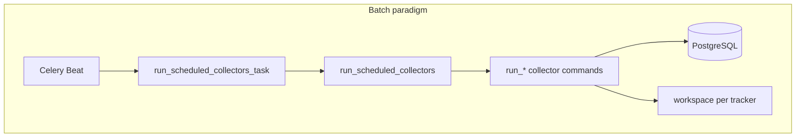
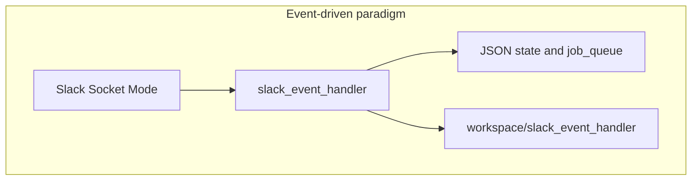
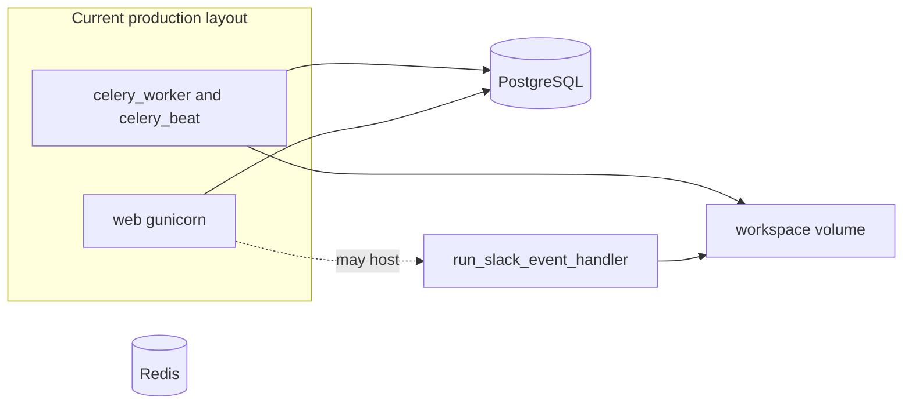
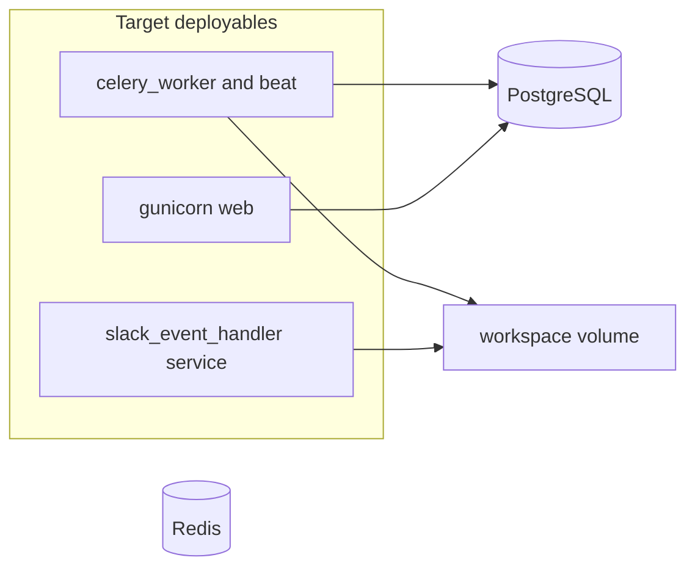

# ADR: Unify batch and event-driven collection paradigms

**Date:** 2026-06-02

## Context

Boost Data Collector runs two collection paradigms in one Django project without explicit architectural separation:

1. **Batch (scheduled) collectors** — YAML-driven schedules executed by Celery Beat → `run_scheduled_collectors_task` → `run_scheduled_collectors`, which invokes `run_*` management commands sequentially within each group batch.
2. **Event-driven (real-time) services** — Slack Socket Mode in `slack_event_handler`, handling WebSocket callbacks and background worker threads concurrently.

Both paradigms share the same process model at deploy time (one monorepo, one PostgreSQL database, one `workspace/` tree, shared `INSTALLED_APPS` and settings). The batch path’s sequential guarantee applies only inside a single `run_scheduled_collectors` invocation; it does not extend to the event-driven path. Yet both can touch the same database and filesystem state.

Production scheduling is defined in [`config/boost_collector_schedule.yaml`](../../config/boost_collector_schedule.yaml). As of this ADR, that file defines **five groups** and **ten tasks** (UTC `default_time` per group):

| Group | `default_time` (UTC) | Tasks (count) |
|-------|----------------------|---------------|
| `github` | 00:05 | 6 (daily, monthly, on_release) |
| `boost_library_docs` | 16:20 | 1 (on_release) |
| `slack` | 16:30 | 1 (daily) |
| `discord` | 16:40 | 1 (daily) |
| `mailing_list` | 00:10 | 1 (daily) |

Several collectors have `run_*` commands but are **not** in the production YAML (see [App classification](#app-classification)). [`config/boost_collector_schedule.yaml.example`](../../config/boost_collector_schedule.yaml.example) shows additional patterns (e.g. `run_clang_github_tracker` weekly, `run_wg21_paper_tracker` interval) that production may adopt later.

Cross-app coupling—especially Foreign Keys into [`cppa_user_tracker`](../cross-app-dependencies.md) as the identity hub—makes module boundaries expensive to move. Untested apps and the absence of versioned deprecation paths ([`STABILITY.md`](../../STABILITY.md)) increase the cost of delaying paradigm separation.

The sequential batch model is simple and reliable for nightly runs across many sources today, but it is a poor fit for planned growth: more sources, more organizations, and higher-frequency collection. Without documented swim lanes, every release that mixes paradigms in one deployable increases operational and correctness risk.

For system context, see [Architecture overview](../Architecture_overview.md), [Architecture data flow](../Architecture_data_flow.md), [Workflow](../Workflow.md), and [Cross-app dependencies](../cross-app-dependencies.md). Bus-factor and onboarding material: [BUS_FACTOR_DELIVERABLES.md](../BUS_FACTOR_DELIVERABLES.md), [onboarding walkthroughs](../onboarding/README.md).

## Decision drivers

- **Correctness** — Concurrency and state-sharing bugs (e.g. file-queue races) must not be masked by “it works on the nightly schedule.”
- **Operability** — Operators need to know which process runs batch work vs real-time listeners, and what fails independently.
- **Scale** — More collectors, schedules, and orgs imply more parallel batch groups and possibly more event-driven entry points.
- **Maintainability** — Cross-app FKs and import-linter contracts ([`cross-app-dependencies.md`](../cross-app-dependencies.md)) favor incremental separation over a big-bang split.
- **Safety net** — Weak test coverage on some apps increases the value of clear boundaries before refactors.

## Paradigm definitions

### Batch (scheduled) paradigm

- **Trigger:** Celery Beat entries built from [`boost_collector_runner/schedule_config.py`](../../boost_collector_runner/schedule_config.py) reading the YAML schedule.
- **Entry point:** [`run_scheduled_collectors_task`](../../boost_collector_runner/tasks.py) → management command [`run_scheduled_collectors`](../../boost_collector_runner/management/commands/run_scheduled_collectors.py).
- **Execution model:** Within one batch, commands run **one after another** (`call_command` in a loop). **Different YAML groups** get **separate Beat entries** and may run **in parallel** on different Celery workers ([`tasks.py`](../../boost_collector_runner/tasks.py) passes `group_id` so each Beat run executes one group’s task list).
- **State:** PostgreSQL via each app’s `services.py`; optional files under `workspace/<app>/`.
- **Sub-mode — interval batch:** Tasks with `schedule: interval` and `minutes: N` are still batch collectors (management commands), but Beat fires them every N minutes independently of group `default_time` ([Workflow](../Workflow.md)).

### Event-driven (real-time) paradigm

- **Trigger:** Slack events over Socket Mode (and related Bolt handlers), not the YAML schedule.
- **Entry point:** [`run_slack_event_handler`](../../slack_event_handler/) (long-running process).
- **Execution model:** Concurrent event callbacks; per-team FIFO job queue with daemon worker threads ([`job_queue.py`](../../slack_event_handler/utils/job_queue.py)).
- **State:** JSON files under `workspace/slack_event_handler/` ([`state.py`](../../slack_event_handler/utils/state.py)); optional GitHub writes via `core.operations`. **No ORM models** in this app.

### Platform layer (not a collection paradigm)

- **`core`** — Collector contracts, errors, shared operations (no domain DB).
- **`cppa_user_tracker`** — Identity hub; batch collectors write through it via FKs and service calls. It is shared infrastructure, not “batch” or “event-driven” by itself.

## Current boundaries

| Separated today | Not separated today |
|-----------------|---------------------|
| Batch orchestration isolated in `boost_collector_runner` | Single Django project and `config/settings.py` |
| Celery worker + Beat run batch tasks ([`docker-compose.yml`](../../docker-compose.yml)) | `slack_event_handler` not a first-class Compose service; often run manually or alongside `web` ([Deployment](../Deployment.md)) |
| Sequential order **within** one `run_scheduled_collectors` run | Parallel **across** YAML groups on multiple workers |
| Event-driven code lives in its own app package | Same PostgreSQL and often same `workspace/` volume mount as batch collectors |
| File locks for Slack PR-bot state **within** `slack_event_handler` | No process-level fence between batch Celery work and Socket Mode in production layout |

## App classification

| Paradigm | Django app | Primary entry | Scheduled in production YAML? |
|----------|------------|---------------|-------------------------------|
| **Platform** | `core` | (library) | N/A |
| **Platform** | `cppa_user_tracker` | `run_cppa_user_tracker` | No |
| **Batch orchestration** | `boost_collector_runner` | `run_scheduled_collectors` | N/A (runner) |
| **Batch collector** | `github_activity_tracker` | via `run_boost_github_activity_tracker` | Yes (via `github` group) |
| **Batch collector** | `boost_library_tracker` | `run_boost_github_activity_tracker`, `collect_boost_libraries`, … | Yes |
| **Batch collector** | `boost_library_docs_tracker` | `run_boost_library_docs_tracker` | Yes (`on_release`) |
| **Batch collector** | `boost_library_usage_dashboard` | `run_boost_library_usage_dashboard` | Yes |
| **Batch collector** | `boost_usage_tracker` | `run_boost_usage_tracker`, `run_update_created_repos_by_language` | Yes |
| **Batch collector** | `boost_mailing_list_tracker` | `run_boost_mailing_list_tracker` | Yes |
| **Batch collector** | `cppa_slack_tracker` | `run_cppa_slack_tracker` | Yes |
| **Batch collector** | `discord_activity_tracker` | `run_discord_activity_tracker` | Yes |
| **Batch collector** | `cppa_pinecone_sync` | `run_cppa_pinecone_sync` | No |
| **Batch collector** | `clang_github_tracker` | `run_clang_github_tracker` | No (in `.example` only) |
| **Batch collector** | `wg21_paper_tracker` | `run_wg21_paper_tracker` | No (in `.example` as interval) |
| **Batch collector** | `cppa_youtube_script_tracker` | `run_cppa_youtube_script_tracker` | No |
| **Event-driven** | `slack_event_handler` | `run_slack_event_handler` | No (by design) |

**Future event-driven candidates** (document only; no commitment): live Discord gateway ingestion, webhooks, or push-based pipelines that cannot be expressed as periodic `run_*` commands. Any such service should follow the same swim lane as `slack_event_handler`, not the YAML batch runner.

## Example: `enqueue_job` race and paradigm boundaries

The Slack PR comment bot illustrates why **in-paradigm** locking matters, and why **process boundaries** help but do not remove **shared-resource** risk.

| Code path | Locking |
|-----------|---------|
| [`enqueue_job`](../../slack_event_handler/utils/job_queue.py) | Mutates queue under [`modify_state`](../../slack_event_handler/utils/state.py) (advisory file lock + in-process mutex) |
| [`estimated_delay_sec`](../../slack_event_handler/utils/job_queue.py) | Calls [`load_state`](../../slack_event_handler/utils/state.py) **without** the file lock |
| Worker loop [`_worker`](../../slack_event_handler/utils/job_queue.py) | Peeks `load_state(...)["queue"]` **without** lock, then dequeues under `modify_state` |

That asymmetry is a time-of-check/time-of-use (TOCTOU) race **inside** the event-driven paradigm: delay estimates and empty-queue sleeps can disagree with concurrent enqueue/dequeue.

**Intended fix (separate work):** Run read-only queue inspection and delay simulation under `state_file_lock` / `modify_state`, or otherwise align all queue readers with the same critical section as writers.

**Why a process boundary helps:** Running `run_slack_event_handler` in a dedicated process (not mixed with Celery worker threads or ad hoc `web` usage) isolates failure domains and makes it obvious that batch sequential guarantees do not apply. It does **not** automatically fix the file-lock bug above.

**What a process boundary does not fix:** Batch collectors and the Slack handler still share **PostgreSQL** (including `cppa_user_tracker` FK writes) and may share **`workspace/`** mounts. Cross-paradigm contention (long-running batch job vs realtime DB load) remains a scheduling and schema-design concern—see [cross-app-dependencies.md](../cross-app-dependencies.md).

## Options considered

### Option A — Monolith, documented swim lanes only

Keep one deployable; document paradigms (this ADR) and coding rules. Lowest effort; weakest isolation.

### Option B — Same monorepo, separate deployable processes (recommended)

- **`collector-batch`:** `celery_worker` + `celery_beat` (unchanged responsibility).
- **`collector-realtime`:** dedicated service running only `run_slack_event_handler`.
- **`web`:** Gunicorn/admin; do not run Socket Mode in the web container.

Shared: PostgreSQL, Redis, `workspace/`, Django settings. No identity-hub DB split in the first phase.

### Option C — Separate services with API boundary for identity

Extract `cppa_user_tracker` behind a versioned API or message bus. Maximum flexibility; highest cost given MTI/FK graph and import-linter contracts. Defer unless scale forces it.

## Decision

Adopt **Option B in phases** (see [Migration path](#migration-path)):

1. Document paradigms and app mapping (this ADR).
2. Harden event-driven state handling (`enqueue_job` / `estimated_delay_sec` locking).
3. Add a first-class realtime deployable in Compose/systemd docs.
4. Improve batch schedule coverage and cross-paradigm DB scheduling discipline.
5. Optionally tighten cross-app contracts via [`core.protocols`](../Core_public_API.md) and [`STABILITY.md`](../../STABILITY.md).

Stay in **one repository and one database** until operational swim lanes prove insufficient. Do not plan a multi-repo split until import/schema coupling is reduced.

**Target deployables (same repo):**

## Consequences

### Positive

- Clear vocabulary for reviews and onboarding ([Architecture overview](../Architecture_overview.md) can link here).
- Safer path to more collectors and higher-frequency batch (`interval`) without overloading one mental model.
- Realtime failures and restarts do not require redeploying the entire batch stack once processes are split.

### Negative / retained coupling

- **`cppa_user_tracker` FK hub** remains; batch and future realtime DB writers still coordinate through PostgreSQL.
- **Import-linter and cross-app imports** still constrain refactors ([cross-app-dependencies.md](../cross-app-dependencies.md)).
- **Two operational surfaces** (Beat schedule + long-running listener) require monitoring and runbooks.
- Phased work does not by itself improve test coverage on untested apps.

## Migration path

| Phase | Scope | Outcome |
|-------|--------|---------|
| **0** | Publish this ADR; link from [docs/README.md](../README.md) | Shared terminology and app→paradigm map |
| **1** | Fix `enqueue_job` / `estimated_delay_sec` / worker peek locking; extend [`test_job_queue.py`](../../slack_event_handler/tests/test_job_queue.py) | Event-driven lane internally consistent under concurrency |
| **2** | Add `slack_event_handler` service to Compose/systemd; update [Docker.md](../Docker.md) and [Deployment.md](../Deployment.md) | Process boundary without repo split |
| **3** | Schedule hygiene: add or document unscheduled `run_*` commands; align prod YAML with `.example` where intended | Batch lane completeness |
| **4** | Operational: stagger heavy batch groups vs realtime peaks; document shared-DB contention mitigations | Reduced cross-paradigm interference |
| **5** (optional) | Expand [`core.protocols`](../Core_public_API.md) DTOs at app edges; follow [`STABILITY.md`](../../STABILITY.md) for deprecations | Safer future extraction |

Phase 0 is satisfied by this document. Phases 1–5 are **future implementation**; they are not part of the ADR file change itself.

## Related work

- **`enqueue_job` race fix** — Phase 1; see [Example: `enqueue_job` race](#example-enqueue_job-race-and-paradigm-boundaries).
- **Schedule gaps** — `run_cppa_user_tracker`, `run_cppa_pinecone_sync`, `run_clang_github_tracker`, `run_wg21_paper_tracker`, `run_cppa_youtube_script_tracker`.
- **Import boundaries** — `lint-imports`, [`scripts/list_cross_app_imports.py`](../../scripts/list_cross_app_imports.py).
- **Workspace orphan grace** — Separate file-writer races documented in [Workspace.md](../Workspace.md) (`WORKSPACE_ORPHAN_INVALID_JSON_GRACE_SECONDS`); analogous “don’t read partial state without coordination” lesson.

## References

- [Workflow.md](../Workflow.md) — batch execution order and Celery Beat behavior
- [boost_collector_runner/README.md](../../boost_collector_runner/README.md)
- [slack_event_handler/README.md](../../slack_event_handler/README.md)
- [Architecture_data_flow.md](../Architecture_data_flow.md) — batch vs long-running in persistence table
- [BUS_FACTOR_DELIVERABLES.md](../BUS_FACTOR_DELIVERABLES.md)
