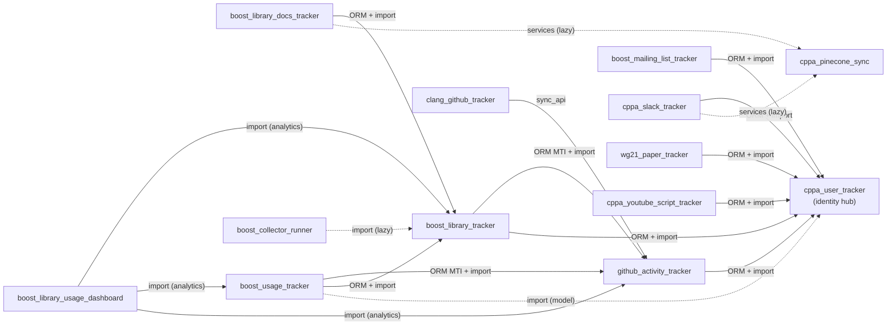

# Cross-App Dependencies

This document maps every cross-app dependency between the tracker Django apps in this
project.  It exists to make the [CONTRIBUTING.md](../CONTRIBUTING.md) guideline — "prefer no
ForeignKey from one tracker app into another's models" — visible and therefore enforceable.
For **typed data boundaries** (run results, activity rows, checkpoints) shared across apps,
prefer :mod:`core.protocols` (see [Core_public_API.md](Core_public_API.md#tracker-protocols-dtos)).

Stability tiers for imports and operational contracts: [STABILITY.md](../STABILITY.md).

**Re-generate the import tables** after large refactors:

```bash
python scripts/list_cross_app_imports.py          # Markdown, prod + tests + ORM candidates
python scripts/list_cross_app_imports.py --no-tests  # production files only
python scripts/list_cross_app_imports.py --format csv > cross_app_imports.csv
```

---

## Tracker App Inventory

Apps listed in `INSTALLED_APPS` (`config/settings.py`) that are in scope for this
document.  `core` is excluded because it is shared infrastructure, not a peer tracker.

| App | Role | Has models? |
| --- | --- | --- |
| `cppa_user_tracker` | Identity hub — GitHub, Slack, Reddit, WG21, mailing-list, and YouTube speaker profiles | Yes |
| `github_activity_tracker` | GitHub repos, files, commits, issues, pull requests | Yes |
| `boost_library_tracker` | Boost libraries, versions, files, dependencies, maintainer roles | Yes |
| `boost_library_docs_tracker` | Boost documentation content and sync status | Yes |
| `boost_library_usage_dashboard` | Aggregation/reporting dashboard (queries multiple trackers) | No (no local `models.py`; reads `boost_usage_tracker` and peers) |
| `boost_usage_tracker` | External repo Boost header usage tracking | Yes |
| `boost_mailing_list_tracker` | Boost mailing list messages | Yes |
| `cppa_pinecone_sync` | Pinecone vector sync status | Yes |
| `clang_github_tracker` | Clang/LLVM GitHub activity | Yes |
| `cppa_slack_tracker` | Slack teams, channels, messages | Yes |
| `reddit_activity_tracker` | Reddit subreddit submissions and comments | Yes |
| `wg21_paper_tracker` | WG21 paper tracking | Yes |
| `cppa_youtube_script_tracker` | YouTube video metadata and transcripts | Yes |
| `boost_collector_runner` | YAML-driven schedule orchestration | No (no domain models) |

---

## 1. Schema Coupling (ORM — FK and MTI in `models.py`)

These are hard database-level dependencies.  They cannot be removed without migrations.

> **Note on `cppa_user_tracker`:** This app acts as an identity hub.  Most tracker
> apps that deal with people still hold an ORM FK into it; **`boost_mailing_list_tracker`**
> is the first app migrated to a **soft profile ID** (`sender_profile_id` / DB column
> `sender_id`) plus service-layer lookup — see [adr/identity-hub-decoupling.md](adr/identity-hub-decoupling.md).
> Remaining FK couplings are documented below and are being phased out in risk order.

| Source app | Target app | Mechanism | Fields / models | Intent |
| --- | --- | --- | --- | --- |
| `github_activity_tracker` | `cppa_user_tracker` | FK | `GitHubRepository.owner_account` → `GitHubAccount` | Intentional — repo owner identity |
| `github_activity_tracker` | `cppa_user_tracker` | FK | `GitCommit.account` → `GitHubAccount` | Intentional — commit author identity |
| `github_activity_tracker` | `cppa_user_tracker` | FK | `Issue.account`, `Issue.assignees` → `GitHubAccount` | Intentional — issue creator / assignees |
| `github_activity_tracker` | `cppa_user_tracker` | FK | `IssueComment.account` → `GitHubAccount` | Intentional — comment author identity |
| `github_activity_tracker` | `cppa_user_tracker` | FK | `PullRequest.account`, `PullRequest.assignees` → `GitHubAccount` | Intentional — PR creator / assignees |
| `github_activity_tracker` | `cppa_user_tracker` | FK | `PullRequestReview.account`, `PullRequestComment.account` → `GitHubAccount` | Intentional — reviewer / commenter identity |
| `boost_library_tracker` | `github_activity_tracker` | MTI | `BoostLibraryRepository` extends `GitHubRepository` | Intentional — Boost repos ARE GitHub repos |
| `boost_library_tracker` | `github_activity_tracker` | OneToOne FK | `BoostFile.github_file` → `GitHubFile` | Intentional — Boost header files ARE GitHub files |
| `boost_library_tracker` | `cppa_user_tracker` | FK | `BoostLibraryRoleRelationship.account` → `GitHubAccount` | Intentional — library maintainer/author identity |
| `boost_library_docs_tracker` | `boost_library_tracker` | FK | `BoostDocContent.first_version`, `.last_version` → `BoostVersion` | Intentional — version range for doc content |
| `boost_library_docs_tracker` | `boost_library_tracker` | FK | `BoostLibraryDocumentation.boost_library_version` → `BoostLibraryVersion` | Intentional — doc-to-library-version join |
| `boost_usage_tracker` | `github_activity_tracker` | MTI | `BoostExternalRepository` extends `GitHubRepository` | Intentional — external repos ARE GitHub repos |
| `boost_usage_tracker` | `github_activity_tracker` | FK | `BoostUsage.file_path` → `GitHubFile` | Intentional — usage anchored to a specific file |
| `boost_usage_tracker` | `boost_library_tracker` | FK | `BoostUsage.boost_header` → `BoostFile` | Intentional — usage anchored to a Boost header |
| `boost_mailing_list_tracker` | `cppa_user_tracker` | Soft ID (`BigIntegerField`, `db_column=sender_id`) | `MailingListMessage.sender_profile_id` → `MailingListProfile.pk` via `cppa_user_tracker.services` | Decoupled (pilot) — no ORM FK; PG FK constraint dropped |
| `wg21_paper_tracker` | `cppa_user_tracker` | FK | `WG21PaperAuthor.profile` → `WG21PaperAuthorProfile` | Intentional — paper author identity |
| `cppa_youtube_script_tracker` | `cppa_user_tracker` | FK | `YouTubeVideoSpeaker.speaker` → `YoutubeSpeaker` | Intentional — speaker identity |
| `cppa_slack_tracker` | `cppa_user_tracker` | Direct import + FK | `SlackChannel.creator`, `SlackMessage.user`, `SlackChannelMembership.user`, `SlackChannelMembershipChangeLog.user` → `SlackUser` | Intentional — channel/message author identity |

---

## 2. ORM Read Coupling (cross-app `.objects` queries outside `models.py`)

The [CONTRIBUTING.md](../CONTRIBUTING.md) service layer rules enforce **write isolation** —
all inserts/updates/deletes go through `services.py`.  However, **read isolation is not
enforced**: any module may call `AnotherApp.Model.objects.filter(...)` directly.

The table below lists the confirmed cases where production code outside `models.py`
queries a foreign app's model via `.objects`:

| Source file | Foreign model queried | Query pattern | Intentional or tech debt |
| --- | --- | --- | --- |
| `boost_usage_tracker/post_process.py` | `boost_library_tracker.BoostFile` | `.objects.filter(github_file__filename__endswith=...)` | Intentional — resolves Boost header path to BoostFile; no service wrapper exists yet |
| `boost_usage_tracker/update_boostusage_from_csv.py` | `github_activity_tracker.GitHubFile` | `.objects.filter(repo_id=..., filename=...)` | Intentional — CSV import resolves FK targets by field values |
| `boost_usage_tracker/update_boostusage_from_csv.py` | `boost_library_tracker.BoostFile` | `.objects.filter(github_file__filename=...)` | Intentional — CSV import resolves Boost header FK |
| `boost_library_tracker/services.py` | `github_activity_tracker.GitHubFile`, `GitHubRepository` | Various `.objects` calls | Intentional — `boost_library_tracker` services manage BoostFile records that extend GitHubFile |
| `boost_library_docs_tracker/management/commands/run_boost_library_docs_tracker.py` | `boost_library_tracker.BoostLibraryVersion`, `BoostVersion` | `.objects` lookups | Intentional — doc scrape is keyed against library versions |
| `boost_library_usage_dashboard/analyzer.py` | `boost_library_tracker.BoostLibrary`, `BoostLibraryVersion`, `BoostVersion` | `.objects.all()` / `.filter()` | Intentional — dashboard aggregates data from all tracker apps by design |
| `boost_library_usage_dashboard/analyzer.py` | `boost_usage_tracker.BoostExternalRepository`, `BoostUsage` | `.objects` aggregate queries | Intentional — dashboard is a read-only reporting layer |
| `boost_library_usage_dashboard/analyzer_libraries.py` | `boost_library_tracker.BoostDependency` | `.objects.values(...)` | Intentional — dependency graph computation |
| `boost_library_usage_dashboard/analyzer_libraries.py` | `github_activity_tracker.GitCommitFileChange` | `.objects.select_related(...).filter(...).iterator()` | Intentional — contribution analytics require commit-file data |
| `boost_library_usage_dashboard/analyzer_metrics.py` | `boost_usage_tracker.BoostUsage` | `.objects` aggregate queries | Intentional — usage metrics |

**Summary:** Cross-app reads are intentional and arise from the FK-linked data model
(the dashboard aggregates peer trackers at query time).  CSV owner resolution in
`update_repository_from_csv.py` delegates to `cppa_user_tracker.services.get_github_account_by_username`
(resolved; see §3).

---

## 3. Python Import Coupling (production files, generated by `scripts/list_cross_app_imports.py`)

This section was generated by running `python scripts/list_cross_app_imports.py --no-tests`.
Each row is one `import`/`from … import` statement where the importing file belongs to a
different tracker app than the module being imported.

The **Kind** column classifies the imported symbol:
`model` = Django model class, `service` = service-layer function, `utility` = workspace/preprocessor/sync helper, `lazy` = import inside a function body (guarded import).

| Source app | Source file | Target app | Symbols | Kind | Intentional or tech debt |
| --- | --- | --- | --- | --- | --- |
| `boost_collector_runner` | `…/run_scheduled_collectors.py` | `boost_library_tracker` | `has_new_boost_release` | utility / lazy | Intentional — schedule runner checks for new Boost releases before running on_release tasks |
| `github_activity_tracker` | `…/services.py` | `cppa_user_tracker` | `GitHubAccount` | model | Intentional — service queries GitHub account identity hub |
| `github_activity_tracker` | `…/sync/commits.py` | `cppa_user_tracker` | `get_or_create_github_account`, `get_or_create_unknown_github_account` | service | Intentional — correctly delegating identity upsert to the identity hub |
| `github_activity_tracker` | `…/sync/issues_and_prs.py` | `cppa_user_tracker` | `get_or_create_github_account` | service | Intentional — correctly delegating identity upsert |
| `boost_library_tracker` | `…/models.py` | `github_activity_tracker` | `GitHubRepository` | model | Intentional — MTI base class (see schema coupling §1) |
| `boost_library_tracker` | `…/services.py` | `github_activity_tracker` | `GitHubFile`, `GitHubRepository` | model | Intentional — BoostFile wraps GitHubFile; service must reference the base models |
| `boost_library_tracker` | `…/services.py` | `cppa_user_tracker` | `GitHubAccount`, `get_or_create_unknown_github_account` | model + service | Intentional — role relationship service looks up identity |
| `boost_library_tracker` | `…/management/commands/run_boost_github_activity_tracker.py` | `cppa_user_tracker` | `get_or_create_owner_account` | service | Intentional — correctly delegates owner-account upsert |
| `boost_library_tracker` | `…/management/commands/run_boost_github_activity_tracker.py` | `github_activity_tracker` | `ensure_repository_owner`, `get_or_create_repository`, `sync_github` | service + utility | Intentional — Boost library sync reuses the GitHub sync machinery |
| `boost_library_tracker` | `…/management/commands/fill_boost_files.py` | `github_activity_tracker` | `GitHubFile` | model | Intentional — populates BoostFile from existing GitHubFile records |
| `boost_library_tracker` | `…/management/commands/backfill_file_renames.py` | `github_activity_tracker` | `GitHubRepository`, `GitHubFile`, `set_github_file_previous_filename` | model + service | Intentional — backfill command uses github_activity_tracker service |
| `boost_library_tracker` | `…/preprocessors/pr_preprocessor.py` | `github_activity_tracker` | `preprocess_all_prs` | utility | Intentional — Boost PR preprocessing reuses the shared GitHub preprocessor |
| `boost_library_tracker` | `…/preprocessors/issue_preprocessor.py` | `github_activity_tracker` | `preprocess_all_issues` | utility | Intentional — same as above for issues |
| `boost_library_docs_tracker` | `…/run_boost_library_docs_tracker.py` | `boost_library_tracker` | `BoostLibraryVersion`, `BoostVersion` | model | Intentional — docs scrape is keyed against library versions |
| `boost_library_docs_tracker` | `…/run_boost_library_docs_tracker.py` | `cppa_pinecone_sync` | `sync_to_pinecone` | sync_api / lazy | Intentional — Pinecone upsert via `cppa_pinecone_sync.sync_api` from collector `sync_pinecone()` |
| `boost_library_usage_dashboard` | `…/analyzer.py` | `boost_library_tracker` | `BoostLibrary`, `BoostLibraryVersion`, `BoostVersion` | model | Intentional — dashboard aggregates from all tracker apps |
| `boost_library_usage_dashboard` | `…/analyzer.py` | `boost_usage_tracker` | `BoostExternalRepository`, `BoostUsage` | model | Intentional — same |
| `boost_library_usage_dashboard` | `…/analyzer_libraries.py` | `github_activity_tracker` | `GitCommitFileChange` | model | Intentional — contribution analytics |
| `boost_library_usage_dashboard` | `…/analyzer_libraries.py` | `boost_library_tracker` | `BoostDependency` | model | Intentional — dependency graph |
| `boost_library_usage_dashboard` | `…/analyzer_metrics.py` | `boost_usage_tracker` | `BoostUsage` | model | Intentional — usage metrics |
| `boost_usage_tracker` | `…/models.py` | `github_activity_tracker` | `GitHubRepository` | model | Intentional — MTI base class (see schema coupling §1) |
| `boost_usage_tracker` | `…/services.py` | `github_activity_tracker` | `GitHubFile`, `GitHubRepository` | model | Intentional — service references models it holds FKs to |
| `boost_usage_tracker` | `…/services.py` | `boost_library_tracker` | `BoostFile` | model | Intentional — service references FK target model |
| `boost_usage_tracker` | `…/post_process.py` | `boost_library_tracker` | `BoostFile` | model | Intentional — resolves Boost headers during batch processing |
| `boost_usage_tracker` | `…/post_process.py` | `github_activity_tracker` | `create_or_update_github_file`, `GitHubRepository` | service + model | Intentional — correctly delegates file creation to github_activity_tracker service |
| `boost_usage_tracker` | `…/management/commands/run_boost_usage_tracker.py` | `github_activity_tracker` | `GitHubRepository`, `get_or_create_repository` | model + service | Intentional — correctly delegates repo upsert |
| `boost_usage_tracker` | `…/management/commands/run_boost_usage_tracker.py` | `cppa_user_tracker` | `get_or_create_owner_account` | service | Intentional — correctly delegates owner-account upsert |
| `boost_usage_tracker` | `…/update_repository_from_csv.py` | `cppa_user_tracker` | `get_github_account_by_username` | service | Intentional — read-only owner lookup via identity hub service |
| `boost_usage_tracker` | `…/update_repository_from_csv.py` | `github_activity_tracker` | `get_or_create_repository` | service | Intentional — correctly delegates |
| `boost_usage_tracker` | `…/update_boostusage_from_csv.py` | `boost_library_tracker` | `BoostFile` | model | Intentional — CSV import resolves FK |
| `boost_usage_tracker` | `…/update_boostusage_from_csv.py` | `github_activity_tracker` | `GitHubFile` | model | Intentional — CSV import resolves FK |
| `boost_usage_tracker` | `…/update_git_account.py` | `cppa_user_tracker` | `GitHubAccountType`, `get_or_create_github_account` | model + service | Intentional — correctly delegates account upsert |
| `boost_usage_tracker` | `…/update_githubfile_from_csv.py` | `github_activity_tracker` | `GitHubRepository`, `create_or_update_github_file` | model + service | Intentional — correctly delegates |
| `boost_usage_tracker` | `…/update_created_repos_by_language.py` | `github_activity_tracker` | `Language`, `create_or_update_created_repos_by_language` | model + service | Intentional — correctly delegates |
| `boost_mailing_list_tracker` | `…/preprocessor.py` | `cppa_user_tracker` | `get_mailing_list_profiles_by_ids` | service | Intentional — bulk sender display names for Pinecone docs |
| `boost_mailing_list_tracker` | `…/run_boost_mailing_list_tracker.py` | `cppa_user_tracker` | `get_or_create_mailing_list_profile` | service | Intentional — correctly delegates |
| `clang_github_tracker` | `…/sync_raw.py` | `github_activity_tracker` | `fetcher`, `save_*_raw_source`, `normalize_*_json`, path helpers (via `sync_api`) | utility | Intentional — cross-app orchestration via `github_activity_tracker.sync_api` |
| `clang_github_tracker` | `…/preprocessors/pr_preprocessor.py` | `github_activity_tracker` | `build_pr_document`, `get_raw_source_pr_path` (via `sync_api`) | utility | Intentional — same |
| `clang_github_tracker` | `…/preprocessors/issue_preprocessor.py` | `github_activity_tracker` | `build_issue_document`, `get_raw_source_issue_path` (via `sync_api`) | utility | Intentional — same |
| `clang_github_tracker` | `…/backfill_clang_github_tracker.py` | `github_activity_tracker` | `normalize_issue_json`, `normalize_pr_json` (via `sync_api`) | utility | Intentional — same |
| `cppa_slack_tracker` | `…/models.py` | `cppa_user_tracker` | `SlackUser` | model | Intentional — FK base class (see schema coupling §1) |
| `cppa_slack_tracker` | `…/services.py` | `cppa_user_tracker` | `SlackUser`, `get_or_create_slack_user` | model + service | Intentional — correctly delegates user upsert |
| `cppa_slack_tracker` | `…/sync/sync_user.py` | `cppa_user_tracker` | `get_or_create_slack_user` | service | Intentional — correctly delegates |
| `cppa_slack_tracker` | `…/run_cppa_slack_tracker.py` | `cppa_pinecone_sync` | `sync_to_pinecone` | sync_api / lazy | Intentional — Pinecone upsert via `cppa_pinecone_sync.sync_api` from collector `sync_pinecone()` |
| `wg21_paper_tracker` | `…/services.py` | `cppa_user_tracker` | `WG21PaperAuthorProfile`, `get_or_create_wg21_paper_author_profile` | model + service | Intentional — correctly delegates author identity |
| `wg21_paper_tracker` | `…/import_wg21_metadata_from_csv.py` | `cppa_user_tracker` | `get_or_create_wg21_paper_author_profile` | service / lazy | Intentional — CSV import delegates author upsert |
| `cppa_youtube_script_tracker` | `…/run_cppa_youtube_script_tracker.py` | `cppa_user_tracker` | `get_or_create_youtube_speaker` | service | Intentional — correctly delegates speaker upsert |

### Summary of tech-debt import edges (resolved)

The five edges from Eval Test 20 / B4 / Compound C2 are **resolved**:

| Source app | Was | Now |
| --- | --- | --- |
| `boost_library_docs_tracker` | Direct `cppa_pinecone_sync.sync` or `.services` import | `cppa_pinecone_sync.sync_api.sync_to_pinecone` in `sync_pinecone()` |
| `cppa_slack_tracker` | Direct `sync` / `ingestion` imports | Same service API |
| `boost_library_usage_dashboard` | `models.py` re-export shim | Shim removed; tests import `boost_usage_tracker.models` directly |
| `boost_usage_tracker` | `GitHubAccount.objects` in CSV import | `cppa_user_tracker.services.get_github_account_by_username` |
| `clang_github_tracker` | Imports from `fetcher`, `sync.*`, `workspace`, `preprocessors` | Imports from `github_activity_tracker.sync_api` only |

CI enforces regressions via **import-linter** (see §5).

---

## 4. Dependency Graph



Solid arrows are always-active imports (top-level or class-level).
Dashed arrows are lazy imports inside function bodies (guarded by `try/except ImportError`
or an `if` block).

---

## 5. Import linting — `import-linter` (enabled)

[`import-linter`](https://import-linter.readthedocs.io/) is in **`requirements-dev.in`**
and runs in CI via the **`import-linter`** pre-commit hook (`lint-imports`).

Configuration: [`.importlinter`](../.importlinter) at the repo root (`exclude_type_checking_imports = True`; **15** `root_packages` including `core` and `reddit_activity_tracker`).

### Two-tier contract model

| Tier | Contract prefix | Purpose |
| --- | --- | --- |
| **Blanket internals** | `forbid-{app}-internals` (×15) | Cross-app code must not import another app's internal submodules (`fetcher`, `sync`, `workspace`, `preprocessors`, `management`, etc.). Public surfaces are always allowed: `models`, `services`, `sync_api`, `api_schemas`. For `core`, additional public modules include `collectors`, `operations`, `protocols`, `adapters`, and related shared infrastructure. |
| **Pair whitelist** | `allow-edge-{source}-to-{target}` (×21) | Each directed production import edge may only reach the target's public API (`models`, `services`, `sync_api`, `api_schemas`). Test-only imports under `{source}.tests.**` are ignored. |

**Stricter legacy contracts** (subset rules, kept for clarity):

| Contract | Purpose |
| --- | --- |
| `forbid-tech-debt-pinecone` | `boost_library_docs_tracker` / `cppa_slack_tracker` must not import `cppa_pinecone_sync.sync`, `.ingestion`, or `.services` directly (use `sync_api`) |
| `forbid-tech-debt-usage-csv-user-model` | `boost_usage_tracker.update_repository_from_csv` must not import `cppa_user_tracker.models` directly |
| `forbid-tech-debt-clang-github-internals` | `clang_github_tracker` must not import `github_activity_tracker` `fetcher`, `sync`, `workspace`, or `preprocessors` directly (use `sync_api`) |
| `forbid-mailing-list-user-models` | `boost_mailing_list_tracker` production modules must not import `cppa_user_tracker.models` (services only) |

**Directed pair contracts** (source → target):

| Source | Target(s) |
| --- | --- |
| `boost_collector_runner` | `boost_library_tracker` |
| `core` | `github_activity_tracker` |
| `cppa_user_tracker` | `cppa_slack_tracker` |
| `github_activity_tracker` | `cppa_user_tracker` |
| `boost_library_tracker` | `github_activity_tracker`, `cppa_user_tracker` |
| `boost_library_docs_tracker` | `boost_library_tracker`, `cppa_pinecone_sync` |
| `boost_library_usage_dashboard` | `boost_library_tracker`, `boost_usage_tracker`, `github_activity_tracker` |
| `boost_usage_tracker` | `github_activity_tracker`, `boost_library_tracker`, `cppa_user_tracker` |
| `boost_mailing_list_tracker` | `cppa_user_tracker` |
| `clang_github_tracker` | `github_activity_tracker` |
| `cppa_slack_tracker` | `cppa_user_tracker`, `cppa_pinecone_sync` |
| `wg21_paper_tracker` | `cppa_user_tracker` |
| `cppa_youtube_script_tracker` | `cppa_user_tracker` |
| `reddit_activity_tracker` | `cppa_user_tracker` |

New collectors: `startcollector` appends the app to `root_packages` but **does not** add contracts — add `forbid-{app}-internals` and any `allow-edge-*` sections when introducing cross-app imports.

### Pre-enforcement audit (resolved)

| Pre-existing violation | Resolution |
| --- | --- |
| `core` → `github_activity_tracker.workspace` | `core/operations/md_ops/github_export.py` now imports path helpers from `github_activity_tracker.sync_api` |
| `boost_library_tracker` preprocessors → `github_activity_tracker.preprocessors` | Batch preprocessors re-exported from `sync_api`; boost preprocessors import via `sync_api` |
| `boost_library_tracker` command → `github_activity_tracker.sync` / `protocol_impl` | `sync_github` and `GitHubSyncTrackerResult` re-exported from `sync_api` |
| `boost_collector_runner` → `boost_library_tracker.release_check` | `has_new_boost_release` exposed on `boost_library_tracker.services` |
| `reddit_activity_tracker` / `core` missing from `root_packages` | Added to `.importlinter` |
| Reactive-only coverage (11 apps unguarded) | Blanket + pair contracts (40 contracts total) |

### Running the linter

```bash
uv run lint-imports          # check all contracts
uv run lint-imports --debug  # verbose output
python scripts/list_cross_app_imports.py --no-tests
python scripts/list_cross_app_imports.py --no-tests --check-importlinter
```

`--check-importlinter` fails when a production import pair has no matching `allow-edge-*` contract in [`.importlinter`](../.importlinter). Run it after adding cross-app imports or before opening a PR that changes coupling.

---

## 6. Service-layer write linting (enabled)

[`scripts/check_service_layer_writes.py`](../scripts/check_service_layer_writes.py) runs in CI via the **`check-service-layer-writes`** pre-commit hook (`uv run python scripts/...`). It AST-scans tracker app Python (excluding `tests/`, `migrations/`, `models.py`) and fails when an ORM **write** (`Model.objects.create`, `bulk_update`, `get_or_create`, `filter().delete()`, `instance.save()`, etc.) targets a model **not** owned by the current file’s `services.py` (writes must live in **`{owning_app}/services.py`**). **Reads** (e.g. `.objects.filter`) are not restricted.

**Allowlist:** [`.service-layer-write-allowlist.json`](../.service-layer-write-allowlist.json) lists grandfathered violations as `{ "file", "line", "model", "eval" }` objects; each must have a nearby `# TODO(service-layer):` line containing the `eval` substring. Prefer an **empty** `violations` array once all debt is cleared.

```bash
uv run python scripts/check_service_layer_writes.py           # exit 1 on violations
uv run python scripts/check_service_layer_writes.py --report  # markdown table
```

### Summary of resolved ORM write tech-debt (historical)

These call sites previously performed writes outside the owning `services.py`; they now delegate to `github_activity_tracker.services` or `boost_library_tracker.services` as appropriate:

| Source file | Change |
| --- | --- |
| `github_activity_tracker/sync/repos.py` | Repo metadata updates via `update_repository_metadata_from_api` |
| `boost_usage_tracker/management/commands/run_boost_usage_tracker.py` | Star bulk updates via `bulk_update_repository_stars` |
| `boost_library_tracker/management/commands/backfill_file_renames.py` | `GitHubFile` rows via `create_or_update_github_file` |
| `boost_library_tracker/management/commands/import_boost_dependencies.py` | `BoostVersion` via `get_or_create_boost_version` |
| `github_activity_tracker/management/commands/backfill_300_file_commits.py` | Clear file changes via `clear_commit_file_changes_for_commit` |

---

## Related documentation

- [CONTRIBUTING.md](../CONTRIBUTING.md) — service-layer write rules
- [Core_public_API.md](Core_public_API.md) — `core` public surfaces and the coupling reduction goal
- [Development_guideline.md](Development_guideline.md) — adding new apps
- [`scripts/list_cross_app_imports.py`](../scripts/list_cross_app_imports.py) — discovery script
