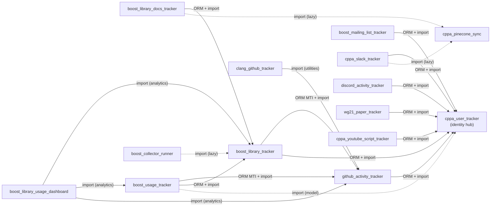

# Cross-App Dependencies

This document maps every cross-app dependency between the tracker Django apps in this
project.  It exists to make the [Contributing.md](Contributing.md) guideline — "prefer no
ForeignKey from one tracker app into another's models" — visible and therefore enforceable.

**Re-generate the import tables** after large refactors:

```bash
python scripts/list_cross_app_imports.py          # Markdown, prod + tests + ORM candidates
python scripts/list_cross_app_imports.py --no-tests  # production files only
python scripts/list_cross_app_imports.py --format csv > cross_app_imports.csv
```

---

## Tracker App Inventory

Apps listed in `INSTALLED_APPS` (`config/settings.py`) that are in scope for this
document.  `core` is excluded because it is shared infrastructure, not a peer tracker.

| App | Role | Has models? |
| --- | --- | --- |
| `cppa_user_tracker` | Identity hub — GitHub, Discord, Slack, WG21, mailing-list, and YouTube speaker profiles | Yes |
| `github_activity_tracker` | GitHub repos, files, commits, issues, pull requests | Yes |
| `boost_library_tracker` | Boost libraries, versions, files, dependencies, maintainer roles | Yes |
| `boost_library_docs_tracker` | Boost documentation content and sync status | Yes |
| `boost_library_usage_dashboard` | Aggregation/reporting dashboard (queries multiple trackers) | Shim only — re-exports from `boost_usage_tracker` |
| `boost_usage_tracker` | External repo Boost header usage tracking | Yes |
| `boost_mailing_list_tracker` | Boost mailing list messages | Yes |
| `cppa_pinecone_sync` | Pinecone vector sync status | Yes |
| `clang_github_tracker` | Clang/LLVM GitHub activity | Yes |
| `cppa_slack_tracker` | Slack teams, channels, messages | Yes |
| `discord_activity_tracker` | Discord servers, channels, messages | Yes |
| `wg21_paper_tracker` | WG21 paper tracking | Yes |
| `cppa_youtube_script_tracker` | YouTube video metadata and transcripts | Yes |
| `slack_event_handler` | Slack event listener | No (no domain models) |
| `boost_collector_runner` | YAML-driven schedule orchestration | No (no domain models) |

---

## 1. Schema Coupling (ORM — FK and MTI in `models.py`)

These are hard database-level dependencies.  They cannot be removed without migrations.

> **Note on `cppa_user_tracker`:** This app acts as an identity hub.  All other
> tracker apps that deal with people (GitHub accounts, Discord/Slack users, WG21
> authors, mailing-list senders, YouTube speakers) hold a FK into it.  This is the
> dominant coupling pattern and is considered **intentional architecture**.

| Source app | Target app | Mechanism | Fields / models | Intent |
| --- | --- | --- | --- | --- |
| `github_activity_tracker` | `cppa_user_tracker` | FK | `GitHubRepository.owner_account` → `GitHubAccount` | Intentional — repo owner identity |
| `github_activity_tracker` | `cppa_user_tracker` | FK | `GitCommit.account` → `GitHubAccount` | Intentional — commit author identity |
| `github_activity_tracker` | `cppa_user_tracker` | FK | `Issue.account`, `Issue.assignees` → `GitHubAccount` | Intentional — issue creator / assignees |
| `github_activity_tracker` | `cppa_user_tracker` | FK | `IssueComment.account` → `GitHubAccount` | Intentional — comment author identity |
| `github_activity_tracker` | `cppa_user_tracker` | FK | `PullRequest.account`, `PullRequest.assignees` → `GitHubAccount` | Intentional — PR creator / assignees |
| `github_activity_tracker` | `cppa_user_tracker` | FK | `PullRequestReview.account`, `PullRequestComment.account` → `GitHubAccount` | Intentional — reviewer / commenter identity |
| `boost_library_tracker` | `github_activity_tracker` | MTI | `BoostLibraryRepository` extends `GitHubRepository` | Intentional — Boost repos ARE GitHub repos |
| `boost_library_tracker` | `github_activity_tracker` | OneToOne FK | `BoostFile.github_file` → `GitHubFile` | Intentional — Boost header files ARE GitHub files |
| `boost_library_tracker` | `cppa_user_tracker` | FK | `BoostLibraryRoleRelationship.account` → `GitHubAccount` | Intentional — library maintainer/author identity |
| `boost_library_docs_tracker` | `boost_library_tracker` | FK | `BoostDocContent.first_version`, `.last_version` → `BoostVersion` | Intentional — version range for doc content |
| `boost_library_docs_tracker` | `boost_library_tracker` | FK | `BoostLibraryDocumentation.boost_library_version` → `BoostLibraryVersion` | Intentional — doc-to-library-version join |
| `boost_usage_tracker` | `github_activity_tracker` | MTI | `BoostExternalRepository` extends `GitHubRepository` | Intentional — external repos ARE GitHub repos |
| `boost_usage_tracker` | `github_activity_tracker` | FK | `BoostUsage.file_path` → `GitHubFile` | Intentional — usage anchored to a specific file |
| `boost_usage_tracker` | `boost_library_tracker` | FK | `BoostUsage.boost_header` → `BoostFile` | Intentional — usage anchored to a Boost header |
| `boost_mailing_list_tracker` | `cppa_user_tracker` | FK | `MailingListMessage.sender` → `MailingListProfile` | Intentional — sender identity |
| `wg21_paper_tracker` | `cppa_user_tracker` | FK | `WG21PaperAuthor.profile` → `WG21PaperAuthorProfile` | Intentional — paper author identity |
| `cppa_youtube_script_tracker` | `cppa_user_tracker` | FK | `YouTubeVideoSpeaker.speaker` → `YoutubeSpeaker` | Intentional — speaker identity |
| `cppa_slack_tracker` | `cppa_user_tracker` | Direct import + FK | `SlackChannel.creator`, `SlackMessage.user`, `SlackChannelMembership.user`, `SlackChannelMembershipChangeLog.user` → `SlackUser` | Intentional — channel/message author identity |
| `discord_activity_tracker` | `cppa_user_tracker` | Direct import + FK | `DiscordMessage.author` → `DiscordProfile` | Intentional — message author identity |

---

## 2. ORM Read Coupling (cross-app `.objects` queries outside `models.py`)

The [Contributing.md](Contributing.md) service layer rules enforce **write isolation** —
all inserts/updates/deletes go through `services.py`.  However, **read isolation is not
enforced**: any module may call `AnotherApp.Model.objects.filter(...)` directly.

The table below lists the confirmed cases where production code outside `models.py`
queries a foreign app's model via `.objects`:

| Source file | Foreign model queried | Query pattern | Intentional or tech debt |
| --- | --- | --- | --- |
| `discord_activity_tracker/services.py` | `cppa_user_tracker.DiscordProfile` | `.objects.filter(discord_user_id__in=...)` | Intentional — bulk prefetch before delegating to `cppa_user_tracker.services`; avoids N+1 |
| `boost_usage_tracker/post_process.py` | `boost_library_tracker.BoostFile` | `.objects.filter(github_file__filename__endswith=...)` | Intentional — resolves Boost header path to BoostFile; no service wrapper exists yet |
| `boost_usage_tracker/update_repository_from_csv.py` | `cppa_user_tracker.GitHubAccount` | `.objects.filter(username=owner).first()` | Tech debt — a `cppa_user_tracker.services.get_github_account_by_username()` would be cleaner |
| `boost_usage_tracker/update_boostusage_from_csv.py` | `github_activity_tracker.GitHubFile` | `.objects.filter(repo_id=..., filename=...)` | Intentional — CSV import resolves FK targets by field values |
| `boost_usage_tracker/update_boostusage_from_csv.py` | `boost_library_tracker.BoostFile` | `.objects.filter(github_file__filename=...)` | Intentional — CSV import resolves Boost header FK |
| `boost_library_tracker/services.py` | `github_activity_tracker.GitHubFile`, `GitHubRepository` | Various `.objects` calls | Intentional — `boost_library_tracker` services manage BoostFile records that extend GitHubFile |
| `boost_library_docs_tracker/management/commands/run_boost_library_docs_tracker.py` | `boost_library_tracker.BoostLibraryVersion`, `BoostVersion` | `.objects` lookups | Intentional — doc scrape is keyed against library versions |
| `boost_library_usage_dashboard/analyzer.py` | `boost_library_tracker.BoostLibrary`, `BoostLibraryVersion`, `BoostVersion` | `.objects.all()` / `.filter()` | Intentional — dashboard aggregates data from all tracker apps by design |
| `boost_library_usage_dashboard/analyzer.py` | `boost_usage_tracker.BoostExternalRepository`, `BoostUsage` | `.objects` aggregate queries | Intentional — dashboard is a read-only reporting layer |
| `boost_library_usage_dashboard/analyzer_libraries.py` | `boost_library_tracker.BoostDependency` | `.objects.values(...)` | Intentional — dependency graph computation |
| `boost_library_usage_dashboard/analyzer_libraries.py` | `github_activity_tracker.GitCommitFileChange` | `.objects.select_related(...).filter(...).iterator()` | Intentional — contribution analytics require commit-file data |
| `boost_library_usage_dashboard/analyzer_metrics.py` | `boost_usage_tracker.BoostUsage` | `.objects` aggregate queries | Intentional — usage metrics |

**Summary:** Most cross-app reads are intentional and arise from the FK-linked data
model (the dashboard must query what it displays).  The one clear tech-debt candidate is
`update_repository_from_csv.py` directly using `GitHubAccount.objects`, which should
delegate to a `cppa_user_tracker` service function.

---

## 3. Python Import Coupling (production files, generated by `scripts/list_cross_app_imports.py`)

This section was generated by running `python scripts/list_cross_app_imports.py --no-tests`.
Each row is one `import`/`from … import` statement where the importing file belongs to a
different tracker app than the module being imported.

The **Kind** column classifies the imported symbol:
`model` = Django model class, `service` = service-layer function, `utility` = workspace/preprocessor/sync helper, `lazy` = import inside a function body (guarded import).

| Source app | Source file | Target app | Symbols | Kind | Intentional or tech debt |
| --- | --- | --- | --- | --- | --- |
| `boost_collector_runner` | `…/run_scheduled_collectors.py` | `boost_library_tracker` | `has_new_boost_release` | utility / lazy | Intentional — schedule runner checks for new Boost releases before running on_release tasks |
| `github_activity_tracker` | `…/services.py` | `cppa_user_tracker` | `GitHubAccount` | model | Intentional — service queries GitHub account identity hub |
| `github_activity_tracker` | `…/sync/commits.py` | `cppa_user_tracker` | `get_or_create_github_account`, `get_or_create_unknown_github_account` | service | Intentional — correctly delegating identity upsert to the identity hub |
| `github_activity_tracker` | `…/sync/issues_and_prs.py` | `cppa_user_tracker` | `get_or_create_github_account` | service | Intentional — correctly delegating identity upsert |
| `boost_library_tracker` | `…/models.py` | `github_activity_tracker` | `GitHubRepository` | model | Intentional — MTI base class (see schema coupling §1) |
| `boost_library_tracker` | `…/services.py` | `github_activity_tracker` | `GitHubFile`, `GitHubRepository` | model | Intentional — BoostFile wraps GitHubFile; service must reference the base models |
| `boost_library_tracker` | `…/services.py` | `cppa_user_tracker` | `GitHubAccount`, `get_or_create_unknown_github_account` | model + service | Intentional — role relationship service looks up identity |
| `boost_library_tracker` | `…/management/commands/run_boost_github_activity_tracker.py` | `cppa_user_tracker` | `get_or_create_owner_account` | service | Intentional — correctly delegates owner-account upsert |
| `boost_library_tracker` | `…/management/commands/run_boost_github_activity_tracker.py` | `github_activity_tracker` | `ensure_repository_owner`, `get_or_create_repository`, `sync_github` | service + utility | Intentional — Boost library sync reuses the GitHub sync machinery |
| `boost_library_tracker` | `…/management/commands/fill_boost_files.py` | `github_activity_tracker` | `GitHubFile` | model | Intentional — populates BoostFile from existing GitHubFile records |
| `boost_library_tracker` | `…/management/commands/backfill_file_renames.py` | `github_activity_tracker` | `GitHubRepository`, `GitHubFile`, `set_github_file_previous_filename` | model + service | Intentional — backfill command uses github_activity_tracker service |
| `boost_library_tracker` | `…/preprocessors/pr_preprocessor.py` | `github_activity_tracker` | `preprocess_all_prs` | utility | Intentional — Boost PR preprocessing reuses the shared GitHub preprocessor |
| `boost_library_tracker` | `…/preprocessors/issue_preprocessor.py` | `github_activity_tracker` | `preprocess_all_issues` | utility | Intentional — same as above for issues |
| `boost_library_docs_tracker` | `…/run_boost_library_docs_tracker.py` | `boost_library_tracker` | `BoostLibraryVersion`, `BoostVersion` | model | Intentional — docs scrape is keyed against library versions |
| `boost_library_docs_tracker` | `…/run_boost_library_docs_tracker.py` | `cppa_pinecone_sync` | `sync_to_pinecone` | service / lazy | Tech debt — Pinecone sync is called directly from the management command instead of going through a declared collector interface in `core` |
| `boost_library_usage_dashboard` | `…/models.py` | `boost_usage_tracker` | `BoostExternalRepository`, `BoostUsage` | model | Tech debt — `models.py` is a re-export shim; the dashboard has no models of its own and should not have a `models.py` that re-exports another app's models |
| `boost_library_usage_dashboard` | `…/analyzer.py` | `boost_library_tracker` | `BoostLibrary`, `BoostLibraryVersion`, `BoostVersion` | model | Intentional — dashboard aggregates from all tracker apps |
| `boost_library_usage_dashboard` | `…/analyzer.py` | `boost_usage_tracker` | `BoostExternalRepository`, `BoostUsage` | model | Intentional — same |
| `boost_library_usage_dashboard` | `…/analyzer_libraries.py` | `github_activity_tracker` | `GitCommitFileChange` | model | Intentional — contribution analytics |
| `boost_library_usage_dashboard` | `…/analyzer_libraries.py` | `boost_library_tracker` | `BoostDependency` | model | Intentional — dependency graph |
| `boost_library_usage_dashboard` | `…/analyzer_metrics.py` | `boost_usage_tracker` | `BoostUsage` | model | Intentional — usage metrics |
| `boost_usage_tracker` | `…/models.py` | `github_activity_tracker` | `GitHubRepository` | model | Intentional — MTI base class (see schema coupling §1) |
| `boost_usage_tracker` | `…/services.py` | `github_activity_tracker` | `GitHubFile`, `GitHubRepository` | model | Intentional — service references models it holds FKs to |
| `boost_usage_tracker` | `…/services.py` | `boost_library_tracker` | `BoostFile` | model | Intentional — service references FK target model |
| `boost_usage_tracker` | `…/post_process.py` | `boost_library_tracker` | `BoostFile` | model | Intentional — resolves Boost headers during batch processing |
| `boost_usage_tracker` | `…/post_process.py` | `github_activity_tracker` | `create_or_update_github_file`, `GitHubRepository` | service + model | Intentional — correctly delegates file creation to github_activity_tracker service |
| `boost_usage_tracker` | `…/management/commands/run_boost_usage_tracker.py` | `github_activity_tracker` | `GitHubRepository`, `get_or_create_repository` | model + service | Intentional — correctly delegates repo upsert |
| `boost_usage_tracker` | `…/management/commands/run_boost_usage_tracker.py` | `cppa_user_tracker` | `get_or_create_owner_account` | service | Intentional — correctly delegates owner-account upsert |
| `boost_usage_tracker` | `…/update_repository_from_csv.py` | `cppa_user_tracker` | `GitHubAccount` | model | Tech debt — directly queries model instead of using a `cppa_user_tracker` service function |
| `boost_usage_tracker` | `…/update_repository_from_csv.py` | `github_activity_tracker` | `get_or_create_repository` | service | Intentional — correctly delegates |
| `boost_usage_tracker` | `…/update_boostusage_from_csv.py` | `boost_library_tracker` | `BoostFile` | model | Intentional — CSV import resolves FK |
| `boost_usage_tracker` | `…/update_boostusage_from_csv.py` | `github_activity_tracker` | `GitHubFile` | model | Intentional — CSV import resolves FK |
| `boost_usage_tracker` | `…/update_git_account.py` | `cppa_user_tracker` | `GitHubAccountType`, `get_or_create_github_account` | model + service | Intentional — correctly delegates account upsert |
| `boost_usage_tracker` | `…/update_githubfile_from_csv.py` | `github_activity_tracker` | `GitHubRepository`, `create_or_update_github_file` | model + service | Intentional — correctly delegates |
| `boost_usage_tracker` | `…/update_created_repos_by_language.py` | `github_activity_tracker` | `Language`, `create_or_update_created_repos_by_language` | model + service | Intentional — correctly delegates |
| `boost_mailing_list_tracker` | `…/services.py` | `cppa_user_tracker` | `MailingListProfile` | model | Intentional — service references FK target |
| `boost_mailing_list_tracker` | `…/run_boost_mailing_list_tracker.py` | `cppa_user_tracker` | `get_or_create_mailing_list_profile` | service | Intentional — correctly delegates |
| `clang_github_tracker` | `…/sync_raw.py` | `github_activity_tracker` | `fetcher`, `save_*_raw_source`, `normalize_*_json`, path helpers | utility | Intentional — clang tracker reuses the GitHub sync/preprocessor machinery; **structural tech debt** — these utilities should move to `core` |
| `clang_github_tracker` | `…/preprocessors/pr_preprocessor.py` | `github_activity_tracker` | `build_pr_document`, `get_raw_source_pr_path` | utility | Same as above |
| `clang_github_tracker` | `…/preprocessors/issue_preprocessor.py` | `github_activity_tracker` | `build_issue_document`, `get_raw_source_issue_path` | utility | Same as above |
| `clang_github_tracker` | `…/backfill_clang_github_tracker.py` | `github_activity_tracker` | `normalize_issue_json`, `normalize_pr_json` | utility | Same as above |
| `cppa_slack_tracker` | `…/models.py` | `cppa_user_tracker` | `SlackUser` | model | Intentional — FK base class (see schema coupling §1) |
| `cppa_slack_tracker` | `…/services.py` | `cppa_user_tracker` | `SlackUser`, `get_or_create_slack_user` | model + service | Intentional — correctly delegates user upsert |
| `cppa_slack_tracker` | `…/sync/sync_user.py` | `cppa_user_tracker` | `get_or_create_slack_user` | service | Intentional — correctly delegates |
| `cppa_slack_tracker` | `…/run_cppa_slack_tracker.py` | `cppa_pinecone_sync` | `sync_to_pinecone`, `PineconeInstance` | service / lazy | Tech debt — same pattern as `boost_library_docs_tracker`; Pinecone sync should go through a collector interface |
| `discord_activity_tracker` | `…/models.py` | `cppa_user_tracker` | `DiscordProfile` | model | Intentional — FK base class (see schema coupling §1) |
| `discord_activity_tracker` | `…/services.py` | `cppa_user_tracker` | `DiscordProfile`, `get_or_create_discord_profile` | model + service | Intentional — services reference FK target and delegate upsert |
| `discord_activity_tracker` | `…/sync/messages.py` | `cppa_user_tracker` | `get_or_create_discord_profile` | service | Intentional — correctly delegates |
| `wg21_paper_tracker` | `…/services.py` | `cppa_user_tracker` | `WG21PaperAuthorProfile`, `get_or_create_wg21_paper_author_profile` | model + service | Intentional — correctly delegates author identity |
| `wg21_paper_tracker` | `…/import_wg21_metadata_from_csv.py` | `cppa_user_tracker` | `get_or_create_wg21_paper_author_profile` | service / lazy | Intentional — CSV import delegates author upsert |
| `cppa_youtube_script_tracker` | `…/run_cppa_youtube_script_tracker.py` | `cppa_user_tracker` | `get_or_create_youtube_speaker` | service | Intentional — correctly delegates speaker upsert |

### Summary of tech-debt import edges

| Source app | Issue | Recommended fix |
| --- | --- | --- |
| `boost_library_docs_tracker` | Calls `cppa_pinecone_sync.sync_to_pinecone` directly from management command | Move Pinecone trigger into the `CollectorBase` / `sync_pinecone()` hook in `core` |
| `cppa_slack_tracker` | Same Pinecone pattern | Same fix |
| `boost_library_usage_dashboard` | `models.py` re-exports `boost_usage_tracker` models | Remove the shim; callers should import from `boost_usage_tracker` directly |
| `boost_usage_tracker` | `update_repository_from_csv.py` uses `GitHubAccount.objects` directly | Add a lookup helper (`get_github_account_by_username`) to `cppa_user_tracker.services` |
| `clang_github_tracker` | Heavy import dependency on `github_activity_tracker` sync/preprocess utilities | Extract shared utilities (`fetcher`, `normalize_*_json`, `save_*_raw_source`, path helpers) into `core.operations` |

---

## 4. Dependency Graph



Solid arrows are always-active imports (top-level or class-level).
Dashed arrows are lazy imports inside function bodies (guarded by `try/except ImportError`
or an `if` block).

---

## 5. Linting Recommendation — `import-linter`

[`import-linter`](https://import-linter.readthedocs.io/) can enforce import contracts at
CI time.  The recommended path is **staged**:

### Stage 1 — Add `import-linter` to dev dependencies

```bash
pip install import-linter
# or add to requirements-dev.txt:
# import-linter>=2.1
```

Then create `.importlinter` at the repo root.

### Stage 2 — Short-term contract: forbid NEW lateral edges between leaf trackers

Start with a low-risk contract that forbids only lateral imports between apps that should
never depend on each other.  This does not disturb existing approved edges.

```ini
[importlinter]
root_packages =
    cppa_pinecone_sync
    clang_github_tracker
    cppa_slack_tracker
    discord_activity_tracker
    wg21_paper_tracker
    cppa_youtube_script_tracker
    slack_event_handler
    boost_mailing_list_tracker
    boost_collector_runner

[importlinter:contract:no-lateral-leaf-imports]
name = No lateral imports between leaf tracker apps
type = forbidden
source_modules =
    cppa_pinecone_sync
    clang_github_tracker
    cppa_slack_tracker
    discord_activity_tracker
    wg21_paper_tracker
    cppa_youtube_script_tracker
    slack_event_handler
    boost_mailing_list_tracker
    boost_collector_runner
forbidden_modules =
    cppa_pinecone_sync
    clang_github_tracker
    cppa_slack_tracker
    discord_activity_tracker
    wg21_paper_tracker
    cppa_youtube_script_tracker
    slack_event_handler
    boost_mailing_list_tracker
    boost_collector_runner
# Existing approved exceptions:
ignore_imports =
    boost_library_docs_tracker.management.commands.run_boost_library_docs_tracker -> cppa_pinecone_sync.sync
    boost_library_docs_tracker.management.commands.run_boost_library_docs_tracker -> cppa_pinecone_sync.ingestion
    cppa_slack_tracker.management.commands.run_cppa_slack_tracker -> cppa_pinecone_sync.sync
    cppa_slack_tracker.management.commands.run_cppa_slack_tracker -> cppa_pinecone_sync.ingestion
    boost_collector_runner.management.commands.run_scheduled_collectors -> boost_library_tracker.release_check
```

### Stage 3 — Long-term contract: enforce the layered architecture

The eventual goal, expressed as a `layers` contract, is that tracker apps may only import
from `core` and their own package:

```ini
[importlinter:contract:tracker-independence]
name = Tracker apps are independent modules (long-term goal)
type = layers
layers =
    cppa_user_tracker
    github_activity_tracker
    boost_library_tracker
    boost_library_docs_tracker : boost_usage_tracker
    boost_library_usage_dashboard
containers =
    (root)
```

This contract will **not** pass until the tech-debt edges listed in §3 are resolved.
Use it as a migration target, not an immediate CI gate.

### Running the linter

```bash
lint-imports          # check all contracts
lint-imports --debug  # verbose output
```

To add it to pre-commit:

```yaml
# .pre-commit-config.yaml
- repo: local
  hooks:
    - id: import-linter
      name: import-linter
      language: python
      entry: lint-imports
      pass_filenames: false
```

---

## Related documentation

- [Contributing.md](Contributing.md) — service-layer write rules
- [Core_public_API.md](Core_public_API.md) — `core` public surfaces and the coupling reduction goal
- [Development_guideline.md](Development_guideline.md) — adding new apps
- [`scripts/list_cross_app_imports.py`](../scripts/list_cross_app_imports.py) — discovery script
